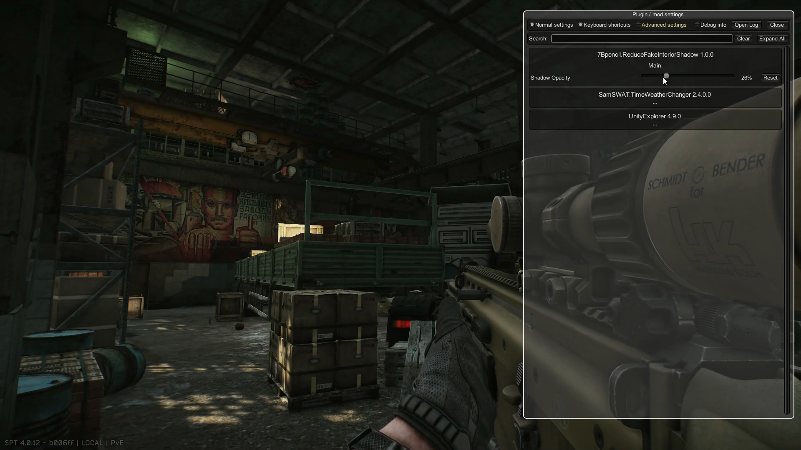
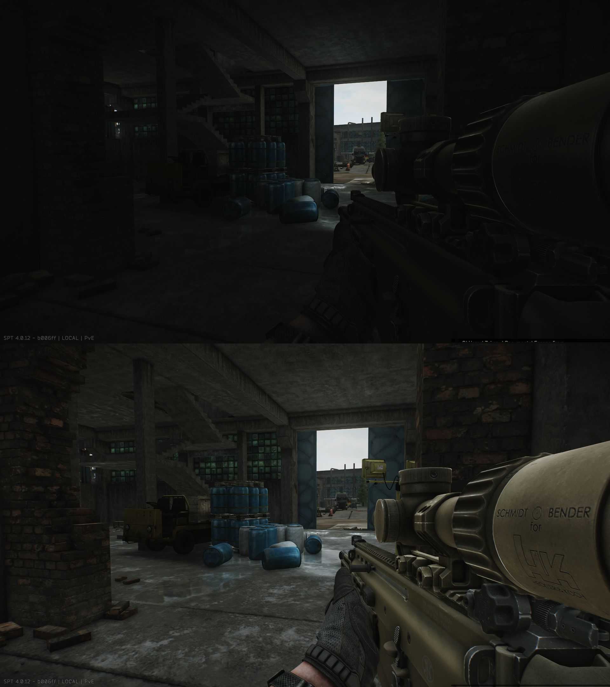

BSG put fake "shadow cubes" inside every interior to compensate for non-existing GI. 
This mod gives you ability to tweak opacity of interior shadows. 
In game press F12 and select mod to tweak settings. 

Demonstration: <https://www.youtube.com/watch?v=vhwed0I2r7E>

Explanation: <https://www.youtube.com/watch?v=jhVJkcdYPXU>

 

 
